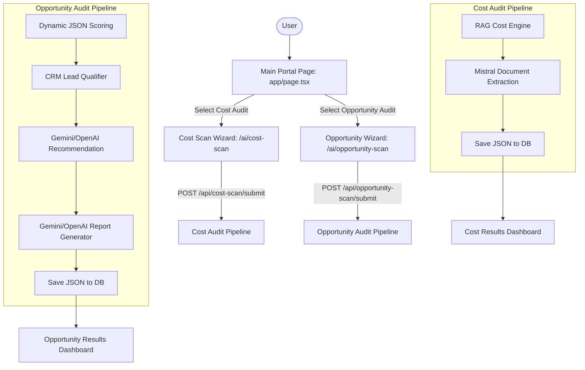

# ⚡ Pixel Punch — AI Assessment Platform

> **Enterprise-grade AI cost diagnostic and opportunity roadmap platform** — a full-stack Next.js application that hosts two specialized auditing products: **AI Cost Audit** (identifying AI spending leakage) and **AI Opportunity Audit** (identifying automation roadmaps and feasibility).

---

## 🚀 The AI Assessment Portal

When users land on the platform, they are presented with a unified portal page (`app/page.tsx`) that splits into two targeted diagnostic workflows:

1. **AI Cost Audit** (Sleek blue branding): Focuses on finding AI spending leaks, scoring cost-architecture risks, and generating optimization reports.
2. **AI Opportunity Audit** (Vibrant indigo/violet branding): Focuses on detecting manual bottlenecks, scoring readiness, and mapping out a phased AI adoption roadmap.

---

## ✨ Features Comparison

| Feature / Layer | 💰 AI Cost Audit | 🔮 AI Opportunity Audit |
| :--- | :--- | :--- |
| **Diagnostic Form** | 🧙 9-Step interactive wizard | 🧙 6-Step interactive wizard |
| **State Persistence** | Session-cached recovery on refresh | Session-cached recovery on refresh |
| **Scoring Engines** | Pure TypeScript RAG score across Spend, Architecture, and Pain | Dynamic JSON-configured scores across 6 operational categories |
| **Lead Qualification** | Rule-based triage ranking (Tiers 1-4) | Weighted SQL/MQL scoring formula (0-100) + custom CRM tags |
| **AI Integration Layer** | Mistral-powered architecture analysis and document extraction | Gemini / OpenAI-powered opportunity matching and roadmap generation |
| **Audit Reports** | Markdown report with Key Findings and Expert Recommendations | Custom consultive Markdown report + parsed Priority Actions |
| **Local DB Store** | JSON files under `data/submissions/` | JSON files under `data/submissions/` |
| **Branding & Design** | Sleek blue/indigo slate UI layout | Premium indigo/violet dynamic UI layout |

---

## 🏗️ System Architecture Flow

All submissions are validated on the server, scored through custom engines, enriched by LLMs (Gemini/OpenAI/Mistral), qualified for sales outreach, and stored securely.



---

## 📂 Project Structure (Modular Architecture)

The codebase is organized into modular product folders (`modules/`) and shareable helpers (`shared/`), enforcing clear domain boundaries.

```text
PixelPunch/
│
├── modules/
│   ├── cost-audit/                    # Cost Scan Product Module
│   │   ├── schema/                    # cost-scan-schema.json
│   │   ├── scoring/                   # cost-score-engine.ts, step4.test.ts
│   │   ├── questions/                 # useCostForm.ts, CostScanWizard.tsx, steps/
│   │   └── results/                   # ResultsPageContent.tsx, templates/
│   │
│   └── opportunity-audit/             # Opportunity Scan Product Module
│       ├── schema/                    # opportunity-schema.json
│       ├── scoring/                   # opportunity-score-engine.ts, config, lead-qualifier
│       ├── questions/                 # useOpportunityForm.ts, OpportunityWizard.tsx, steps/
│       └── results/                   # OpportunityResultsContent.tsx
│
├── shared/                            # Shareable Domain Core
│   ├── components/                    # ContactBar.tsx, animations.ts, WizardUI.tsx
│   ├── database/                      # db.service.ts (JSON persistence layer)
│   └── utils/                         # brevo.service.ts, extractor.service.ts
│
├── app/                               # Next.js App Router (Renders modules)
│   ├── ai/
│   │   ├── cost-scan/                 # Cost landing page & results page
│   │   └── opportunity-scan/          # Opportunity landing page & results page
│   └── api/
│       ├── cost-scan/                 # submit / result / pdf endpoints
│       └── opportunity-scan/          # submit / result endpoints
│
├── proxy.ts                           # Next.js 16 Security Proxy (Headers CSP/HSTS)
├── tailwind.config.js                 # Global CSS utility mappings
└── package.json
```

---

## 🧠 Scoring & Sales Intelligence

### 1. Cost Audit RAG Engine
Evaluates user answers across three dimensions:
- **Spend**: `monthly_spend_band` + `spend_visibility`. High spend and low visibility flag **Red**.
- **Architecture**: `leakage_pattern` + `optimization_done`. Unmanaged routing or no prior audits flag **Red**.
- **Pain**: `main_pain` + `savings_threshold`. Acute margin pressure and high savings targets flag **Red**.

### 2. Opportunity Category Scoring & Lead Qualification
- **6 Category Dimensions**: Calculates scores out of 100 for *Data Maturity, Process Maturity, Integration Readiness, Business Impact, AI Readiness*, and *Automation Opportunity* using weights configured in [opportunity-scoring-config.json](file:///d:/Yash%20Coding2/new/PixelPunch/modules/opportunity-audit/scoring/opportunity-scoring-config.json).
- **Lead Qualifier**: Evaluates lead scores (0-100) based on size, pain levels, and manual work density. Mapped directly to CRM-ready payloads:
  * **Tier 1: High AI Opportunity (SQL)** -> Routed to sales priority inbox (Tags: `LEAD_SQL`, `HIGH_PRIORITY`).
  * **Tier 2: Good Fit (MQL)** -> Routed to standard sales inbox (Tags: `LEAD_MQL`).
  * **Tier 3: Needs Education (NURTURE)** -> Routed to nurture campaign.
  * **Tier 4: Not Ready (DISQUALIFIED)** -> Routed to cold archive.

---

## 🛡️ Security Hardening

The platform implements multi-layered security controls to protect endpoints and server files:

- **Path Traversal Protection**: The database service ([db.service.ts](file:///d:/Yash%20Coding2/new/PixelPunch/shared/database/db.service.ts)) validates all read/write file lookup identifiers against an alphanumeric-and-dash regex whitelist (`/^[a-zA-Z0-9-]{10,50}$/`). Directory traversal characters (`..`, `/`, `\`) are immediately rejected.
- **Next.js 16 Security Proxy**: A gateway wrapper at `proxy.ts` automatically injects strict security headers on all matching request paths:
  * **Content Security Policy (CSP)**: restrains script, style, image, and connection origins to block Cross-Site Scripting (XSS).
  * **X-Frame-Options (DENY)**: completely blocks clickjacking attempts.
  * **X-Content-Type-Options (nosniff)**: disables MIME-type sniffing.
  * **Strict-Transport-Security (HSTS)**: forces encrypted HTTPS/SSL connections.
- **Rate-Limiting**: Route handlers implement rate-limit checks to prevent request floods on Gemini/OpenAI API integrations.

---

## 🚀 Quick Start (Local Development)

### 1. Install Dependencies
```bash
npm install
```

### 2. Configure Environment Variables
Create a `.env` or `.env.local` file in the root directory:
```env
# AI APIs
GEMINI_API_KEY=your_gemini_api_key
OPENAI_API_KEY=your_openai_api_key
MISTRAL_API_KEY=your_mistral_api_key

# CRM & Search APIs
BREVO_API_KEY=your_brevo_api_key
TAVILY_API_KEY=your_tavily_api_key
```

### 3. Run the Development Server
```bash
# Start server with stable Webpack compiler (Recommended on Windows/HDDs to prevent watcher panics)
npm run dev -- --no-turbo
```

---

## 🧪 Running Unit Tests

Each module scoring engine and API layout is fully covered by pure unit tests:

```bash
# Run Cost Audit scoring tests
npm run test:step4

# Run Opportunity Audit config scoring tests
npx ts-node -r tsconfig-paths/register --project tsconfig.json modules/opportunity-audit/scoring/opportunity-score-engine.test.ts

# Run Opportunity AI recommendation engine tests
npx ts-node -r tsconfig-paths/register --project tsconfig.json modules/opportunity-audit/scoring/opportunity-recommendation-engine.test.ts

# Run Opportunity Report generator tests
npx ts-node -r tsconfig-paths/register --project tsconfig.json modules/opportunity-audit/scoring/opportunity-report-generator.test.ts

# Run Sales Lead qualification tests
npx ts-node -r tsconfig-paths/register --project tsconfig.json modules/opportunity-audit/scoring/opportunity-lead-qualifier.test.ts
```

---

*Developed by & for [Pixel Punch](https://pixelpunch.org)*
