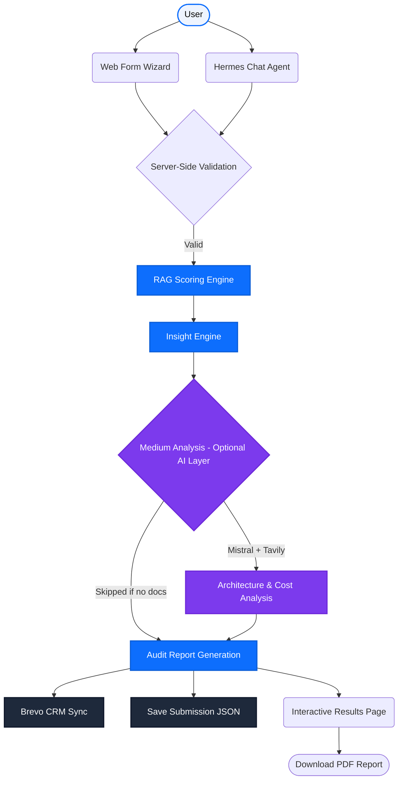

# ⚡ Pixel Punch — AI Cost Architecture Scan

> **Enterprise-grade AI cost diagnostic platform** — a full-stack Next.js 15 application that helps organisations identify AI cost leakage and receive tailored optimisation recommendations via an interactive wizard or a conversational chat agent.

---

## ✨ Features

| Feature | Description |
|---|---|
| 🧙 **9-Step Wizard** | Polished multi-step diagnostic flow with per-step validation and smooth Framer Motion transitions |
| 🤖 **Hermes Chat Agent** | Conversational entry-point that runs the same diagnostic engine through a structured Q&A flow |
| 📊 **RAG Scoring Engine** | Pure TypeScript engine calculating Red / Amber / Green status across Spend, Architecture, and Pain |
| 💡 **Rule-Based Insight Engine** | Config-driven insight generation from `cost-scan-insights.json` — no inference required |
| 🔬 **AI-Powered Deep Analysis** | Optional layer using Mistral AI + Tavily to analyse uploaded documents, architecture diagrams, and cost evidence |
| 📄 **PDF Report** | One-click, client-side PDF export of full scan results via `html2pdf.js` |
| 📬 **Brevo CRM Sync** | Automatic contact upsert and engagement-score update in Brevo on every submission |
| 🗄️ **Local Submission Store** | JSON-file persistence layer (`data/submissions/`) for server-side result retrieval |
| 🎨 **Premium UI** | Glassmorphism, dark-mode design system, Inter font, Lucide React icons, and micro-animations |

---

## 🏗️ System Architecture

All user inputs — whether from the form wizard or the Hermes chat agent — are funnelled through a unified validation and scoring pipeline.



---

## 📂 Project Structure (Feature-Sliced Design)

```text
PixelPunch/
│
├── app/                              # Next.js 15 App Router
│   ├── ai/
│   │   └── cost-scan/
│   │       ├── page.tsx              # Wizard entry page
│   │       └── results/
│   │           └── page.tsx          # Results display page
│   ├── api/
│   │   └── cost-scan/
│   │       ├── submit/               # POST — validate, score, analyse, persist
│   │       ├── result/               # GET  — retrieve saved submission by ID
│   │       └── pdf/                  # PDF generation endpoint
│   ├── globals.css                   # Tailwind entry point & global print rules
│   ├── layout.tsx                    # Root layout (fonts, Toaster, metadata)
│   └── page.tsx                      # Root redirect page
│
├── features/
│   └── cost-scan/                    # Unified Cost Scan domain module (FSD)
│       ├── components/
│       │   ├── wizard/
│       │   │   ├── CostScanWizard.tsx        # Top-level wizard orchestrator
│       │   │   ├── WizardUI.tsx              # Shared wizard chrome (header, nav, progress)
│       │   │   └── steps/
│       │   │       ├── AiDependenceStep.tsx  # Step 1 — AI dependency level
│       │   │       ├── SpendBandStep.tsx     # Step 2 — monthly spend & visibility
│       │   │       ├── UnitEconomicsStep.tsx # Step 3 — cost metrics tracked
│       │   │       ├── PainStep.tsx          # Step 4 — main pain point
│       │   │       ├── LeakageStep.tsx       # Step 5 — leakage pattern
│       │   │       ├── OptimizationStep.tsx  # Step 6 — optimisation history
│       │   │       ├── ThresholdStep.tsx     # Step 7 — savings threshold
│       │   │       ├── TechnicalStep.tsx     # Step 8 — AI stack, docs & metrics upload
│       │   │       └── ContactStep.tsx       # Step 9 — lead capture
│       │   └── results/
│       │       ├── ResultsPageContent.tsx    # Full results UI orchestrator
│       │       ├── ScoreCard.tsx             # RAG scorecard display
│       │       ├── InsightsList.tsx          # Tailored insights list
│       │       ├── TierRecommendation.tsx    # Service tier recommendation card
│       │       ├── TierCTA.tsx               # Call-to-action button by tier
│       │       ├── ShareResults.tsx          # Share / copy results link
│       │       ├── PdfButton.tsx             # PDF export trigger
│       │       ├── PdfReportTemplate.tsx     # Printable report layout
│       │       └── ResultsSkeleton.tsx       # Loading skeleton
│       ├── hooks/
│       │   ├── useCostScanForm.ts    # All wizard form state & per-step validation
│       │   └── useSubmitScan.ts      # API submission & sessionStorage persistence
│       ├── types/
│       │   └── index.ts              # FormState, ScorecardResult, Rag enums & helpers
│       └── utils/
│           └── server-validation.ts  # Server-side input validation
│
├── hermes/                           # Conversational Agent (Hermes)
│   ├── questionnaire.ts              # 10-question ordered definitions
│   ├── costScanConversation.ts       # Stateful CostScanConversation class
│   ├── apiClient.ts                  # Hermes → /api/cost-scan/submit bridge
│   └── responseHandler.ts            # Parse & format API responses for chat UI
│
├── services/                         # Server-side service layer
│   ├── scoring.service.ts            # Thin wrapper over scoring-engine.ts
│   ├── insight.service.ts            # Rule-based insight generation from JSON config
│   ├── audit.service.ts              # Mistral-powered audit report generation (498 lines)
│   ├── medium-analysis.service.ts    # Document parsing + Mistral AI analysis (529 lines)
│   ├── extractor.service.ts          # PDF / DOCX text extraction via officeparser
│   ├── brevo.service.ts              # Brevo CRM contact upsert & engagement scoring
│   └── db.service.ts                 # JSON file-based submission persistence
│
├── src/
│   └── scoring/
│       ├── scoring-engine.ts         # Pure scoring logic — scoreSpend, scoreArchitecture, scorePain, computeTier
│       └── step4.test.ts             # Step 4 scoring unit tests
│
├── config/
│   └── cost-scan/
│       ├── cost-scan-insights.json   # Rule-based insight templates (priority-ordered)
│       └── score-descriptions.json   # Human-readable RAG score label copy
│
├── data/
│   └── submissions/                  # Auto-created at runtime; stores <submissionId>.json files
│
├── docs/
│   └── cost-scan-schema.json         # Canonical API contract / full form schema
│
├── components/
│   └── ui/
│       ├── ContactBar.tsx            # Shared contact info bar component
│       └── animations.ts             # Shared Framer Motion animation presets
│
├── public/                           # Static assets
├── .env                              # Local secrets reference (never commit real keys)
├── next.config.js
├── tailwind.config.js
└── tsconfig.json
```

---

## 🧠 Scoring Engine

The scoring engine (`src/scoring/scoring-engine.ts`) is a pure, side-effect-free TypeScript module with full unit-test coverage. It evaluates user answers across three independent dimensions:

| Dimension | Key Inputs | RAG Logic |
|---|---|---|
| **Spend** | `monthly_spend_band`, `spend_visibility`, `ai_dependence`, `unit_economics` | High spend + low visibility → Red |
| **Architecture** | `leakage_pattern`, `optimization_done` | Weak routing / no prior audit → Red |
| **Pain** | `main_pain`, `savings_threshold` | Acute pain + high savings target → Red |

`computeTier()` combines all three RAG scores into a tier (1–4) that drives the CTA URL and the recommended service package.

---

## 🔬 AI-Powered Medium Analysis (Optional)

When a user uploads documents in **Step 8 (Technical Resources)**, the `medium-analysis.service.ts` activates an additional AI pipeline:

1. **Document Extraction** — `extractor.service.ts` decodes base64 uploads and uses `officeparser` to extract plain text from PDF, DOCX, DOC, TXT, and MD files.
2. **Confidence Score** — Calculated as a percentage based on data completeness: questionnaire (20%) + website URL (15%) + AI stack (15%) + documents (20%) + architecture diagrams (15%) + cost evidence (15%).
3. **Architecture Analysis** — Mistral AI analyses architecture diagrams for structural findings and risks.
4. **Cost Analysis** — Mistral AI normalises cost evidence into structured fields (monthly spend, provider, model usage, GPU cost, unused resources).
5. **Audit Report** — `audit.service.ts` calls Mistral AI to generate a full markdown audit report with actionable findings and prioritised recommendations.

---

## 🤖 Hermes Agent

Hermes is the conversational entry point to the diagnostic engine, living entirely within `/hermes/`:

| File | Role |
|---|---|
| `questionnaire.ts` | Defines all 10 questions with type, options, and exclusive-option logic |
| `costScanConversation.ts` | Stateful class tracking question index, accumulated answers, and submission state |
| `apiClient.ts` | Bridges completed conversation into a standard `POST /api/cost-scan/submit` call |
| `responseHandler.ts` | Formats API results into a structured `HermesResponse` for the chat UI |

Hermes submissions are automatically tagged with `ref: "co-hermes"` for CRM tracking.

---

## 🚀 Quick Start (Local Development)

### Prerequisites
- Node.js 18+
- npm

### 1. Install Dependencies

```bash
npm install
```

### 2. Configure Environment Variables

Create a `.env.local` file in the project root (**never commit real keys**):

```env
# Required — Brevo CRM integration
BREVO_API_KEY=your_brevo_api_key_here

# Required — AI-powered audit & analysis
MISTRAL_API_KEY=your_mistral_api_key_here

# Required — Web-search enrichment during analysis
TAVILY_API_KEY=your_tavily_api_key_here

# Optional — HMAC verification for Hermes server-to-server calls
COST_SCAN_WEBHOOK_SECRET=your_webhook_secret_here
```

### 3. Run the Development Server

```bash
npm run dev
```

The application starts at **`http://localhost:3000`**

| Route | Description |
|---|---|
| `/ai/cost-scan` | 9-step wizard entry point |
| `/ai/cost-scan/results?id=<id>` | Results page for a submission |

---

## 🔌 API Reference

All routes live under `app/api/cost-scan/` and are compiled to Vercel Serverless Functions on deploy.

### `POST /api/cost-scan/submit`

Accepts the full `FormState` payload. Runs validation → scoring → insight generation → optional medium analysis → Brevo CRM sync → local persistence.

**Response shape** (`ScorecardResult`):
```json
{
  "submissionId": "uuid-v4",
  "scorecard": { "spend": "red", "architecture": "amber", "pain": "green" },
  "tier": 2,
  "insights": ["..."],
  "ctaUrl": "https://pixelpunch.org/ai?ref=co-scan-book",
  "auditReport": "## AI Cost Audit Report\n...",
  "findings": ["..."],
  "recommendations": ["..."],
  "confidenceScore": "75% (High)",
  "architectureAnalysis": { "summary": "...", "findings": [], "risks": [] },
  "costAnalysis": { "summary": "...", "normalizedData": {} }
}
```

### `GET /api/cost-scan/result?id=<submissionId>`

Retrieves a previously saved submission from `data/submissions/<id>.json`.

### `GET /api/cost-scan/pdf?id=<submissionId>`

Returns stored submission data for server-side PDF rendering.

---

## 🎨 Tech Stack

| Category | Technology |
|---|---|
| **Framework** | Next.js 15 (App Router) |
| **Language** | TypeScript 5 |
| **Styling** | Tailwind CSS v3 |
| **Animations** | Framer Motion 12 |
| **Icons** | Lucide React |
| **Fonts** | Inter (Google Fonts) |
| **PDF Export** | html2pdf.js |
| **Document Parsing** | officeparser (PDF, DOCX, DOC) |
| **AI / LLM** | Mistral AI API |
| **Web Search** | Tavily Search API |
| **CRM** | Brevo (formerly Sendinblue) |
| **Toast Notifications** | react-hot-toast |
| **Persistence** | Local JSON file store (no database required) |

---

## ☁️ Deployment (Vercel)

This project is optimised for zero-config deployment on Vercel.

1. Push code to a GitHub repository.
2. Log in to [Vercel](https://vercel.com) and import the repository.
3. In **Project Settings → Environment Variables**, add all four keys shown in the env section above.
4. Click **Deploy**. Vercel auto-converts `app/api/` into Serverless Functions.

> **Important**: The `data/submissions/` file store is ephemeral on Vercel's read-only filesystem. For production at scale, replace `db.service.ts` with a database adapter (e.g. Vercel KV, PlanetScale, or Supabase).

---

## 🧪 Running Tests

```bash
# Scoring engine unit tests (Step 4 scoring scenarios)
npm run test:step4
```

---

## 📋 Diagnostic Questionnaire — Question Map

| # | Question ID | Type | Description |
|---|---|---|---|
| 1 | `ai_dependence` | Single | AI dependency level (core revenue → experiments → none) |
| 2 | `monthly_spend_band` + `spend_visibility` | Single × 2 | Monthly AI spend range & how clearly it is tracked |
| 3 | `unit_economics` | Multi-select | Cost metrics currently tracked (per-request, per-task, per-customer) |
| 4 | `main_pain` | Single | Primary cost challenge (bills growing, margin pressure, etc.) |
| 5 | `leakage_pattern` | Single | Suspected leakage source (large prompts, premium models, idle GPU…) |
| 6 | `optimization_done` | Multi-select | Prior optimisation steps taken (formal audit, prompt tuning, etc.) |
| 7 | `savings_threshold` | Single | Minimum savings % to justify a deeper audit |
| 8 | Technical Resources | Mixed | Website URL, AI providers/models, infrastructure, document uploads, usage metrics |
| 9 | `contact_info` | Contact | First name, last name, email, company, job title |

---

## 🏷️ Tracking & CTA Tiers

Submissions are tagged with a `ref` value to track the entry point:

| Ref | Entry Point |
|---|---|
| `co-e2-scan` | Direct form embed |
| `co-landing` | Landing page |
| `co-hermes` | Hermes chat agent |
| `co-scan-book` | Scan booking flow |

CTA URLs are assigned by computed tier:

| Tier | Condition | CTA Destination |
|---|---|---|
| 1–2 | High severity (≥2 Red scores) | Book AI audit session |
| 3 | Medium severity | Cost optimisation content hub |
| 4 | Low severity | Self-serve learning resources |

---

*Developed by & for [Pixel Punch](https://pixelpunch.org)*
