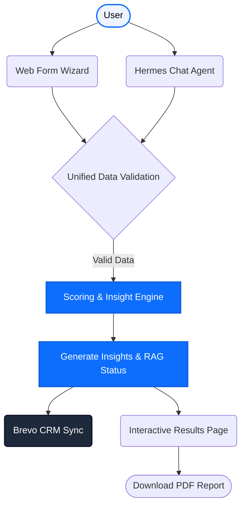

# ⚡ Pixel Punch AI | Cost Architecture Scan

A premium, enterprise-grade AI Cost Architecture Evaluation tool. This application provides a seamless, interactive experience for users to diagnose their cloud and AI infrastructural costs, pinpointing leakage and offering actionable, high-ROI optimization strategies. 

It is built with a state-of-the-art **Next.js 15 App Router** stack, utilizing a clean **Feature-Sliced Design (FSD)** architecture.

## ✨ Features
- **Intelligent Multi-Step Wizard**: A highly polished 8-step diagnostic flow with dynamic validations.
- **Hermes Conversational Agent**: An alternative chat-based entry point to the diagnostic engine.
- **Enterprise UI/UX**: Glassmorphism, smooth micro-animations (Framer Motion), and Lucide React icons.
- **Scoring Engine**: Calculates an architectural RAG (Red, Amber, Green) status and generates tailored insights.
- **Brevo CRM Integration**: Syncs leads directly into the company's mailing backend.
- **Print to PDF**: Instantly generate clean, printable PDF reports of the final scan.

## 🏗 System Architecture

The core of the application funnels user responses (either via the Web Form or the Hermes Chat Agent) into a unified Scoring Engine.



## 📂 Project Structure (Feature-Sliced Design)

This codebase follows professional FSD principles, grouping code by domain feature rather than by technical type.

```text
PixelPunch/
├── app/
│   ├── ai/cost-scan/     # Next.js App Router Pages
│   ├── api/              # Serverless API Backend
│   └── globals.css       # Tailwind entry point & print rules
├── features/
│   └── cost-scan/        # Unified Cost Scan Domain Module
│       ├── components/   # Wizard steps & Result UI
│       ├── hooks/        # Form state & submission logic
│       ├── types/        # TypeScript interfaces
│       └── utils/        # Server-side scoring engine
├── hermes/               # Conversational Agent Module
├── services/             # 3rd Party Integrations (Brevo)
└── tailwind.config.js    # Tailwind configuration
```

## 🚀 Quick Start (Local Development)

1. **Install Dependencies**
   ```bash
   npm install
   ```

2. **Environment Variables**
   Create a `.env.local` file in the root directory and add your secrets (e.g., Brevo API Keys).
   ```env
   BREVO_API_KEY=your_secret_key
   ```

3. **Run the Development Server**
   ```bash
   npm run dev
   ```
   *The application will start at `http://localhost:3000`*

## ☁️ Deployment (Vercel)

This project is optimized for deployment on Vercel. 

1. Push your code to a GitHub repository.
2. Log in to [Vercel](https://vercel.com).
3. Import the repository.
4. **Important**: Add your `.env.local` keys to the **Environment Variables** section in the Vercel project settings.
5. Deploy! Vercel will automatically convert the `app/api` directory into Serverless Functions.

---
*Developed for Pixel Punch*
