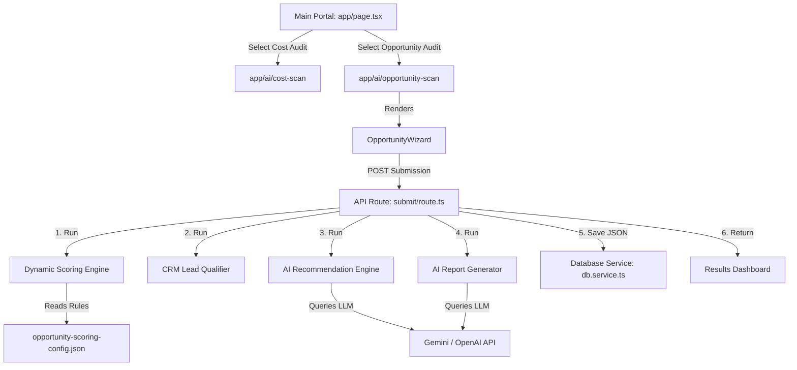

# AI Opportunity Audit — Production SaaS Architecture Blueprint

This blueprint outlines the complete production-grade SaaS architecture for the **AI Opportunity Audit** platform built for PixelPunch.

---

## 1. System Overview & Modular Architecture

The platform is designed around strict separation of concerns, ensuring that the **AI Cost Audit** and **AI Opportunity Audit** modules operate independently while sharing common utilities (database interfaces, email dispatchers, and layouts) in the `shared/` directory.



---

## 2. Directory Structure

```
project/
├── modules/
│   ├── cost-audit/                    # Cost Scan Module
│   │   ├── schema/
│   │   ├── scoring/
│   │   ├── questions/
│   │   └── results/
│   └── opportunity-audit/             # Opportunity Scan Module
│       ├── schema/
│       │   └── opportunity-schema.json
│       ├── scoring/
│       │   ├── opportunity-score-engine.ts
│       │   ├── opportunity-scoring-config.json
│       │   ├── opportunity-recommendation-engine.ts
│       │   ├── opportunity-report-generator.ts
│       │   └── opportunity-lead-qualifier.ts
│       ├── questions/
│       │   ├── OpportunityWizard.tsx
│       │   ├── steps/                 # Steps 1 to 6
│       │   └── hooks/                 # useOpportunityForm, useSubmitOpportunity
│       └── results/
│           └── OpportunityResultsContent.tsx
├── shared/                            # Reusable Shared Assets
│   ├── components/                    # WizardUI, ContactBar, animations
│   ├── database/                      # db.service.ts (JSON storage)
│   └── utils/                         # brevo.service.ts, extractor.service.ts
└── app/
    ├── ai/
    │   ├── cost-scan/
    │   └── opportunity-scan/          # Next.js Page & Results
    └── api/
        ├── cost-scan/
        └── opportunity-scan/          # Submit & Retrieve APIs
```

---

## 3. Database Schema Model

Submissions are persisted as structured JSON documents. The schema encapsulates metadata, diagnostic answers, scoring scorecard dimensions, AI recommendations, report markdown content, and sales qualification metrics.

### JSON Schema Blueprint
```json
{
  "submissionId": "uuid-v4-string",
  "createdDate": "ISO-8601-timestamp",
  "auditStatus": "completed",
  "company": {
    "name": "string",
    "industry": "string",
    "size": "1_10 | 11_50 | 51_200 | 201_500 | 501_plus",
    "businessType": "string"
  },
  "contact": {
    "firstname": "string",
    "lastname": "string",
    "email": "string",
    "job_title": "string"
  },
  "answers": {
    "business_type": "string",
    "main_outcome": "string",
    "biggest_challenge": "string",
    "data_systems": ["string"],
    "automation_barriers": "string",
    "workflow_standardization": "string",
    "manual_processes": ["string"],
    "info_retrieval": "string",
    "systems_connection": "string",
    "data_quality": "string",
    "inquiry_handling": "string",
    "request_types": "string",
    "lead_qualification": "string",
    "desired_use_case": "string",
    "adoption_blocker": "string",
    "extra_context": "string",
    "ref": "string"
  },
  "score": {
    "readiness": "red | amber | green",
    "value": "red | amber | green",
    "opportunity": "red | amber | green",
    "tier": 1 | 2 | 3 | 4,
    "categories": {
      "automation_opportunity": { "score": 85, "classification": "high" },
      "ai_readiness": { "score": 60, "classification": "medium" }
      // ... maps all 6 categories
    }
  },
  "recommendations": [
    {
      "opportunity": "AI Customer Support Agent",
      "problem": "Manual support ticket handling",
      "impact": "Reduce triage overhead by 60%",
      "complexity": "Medium",
      "priority": "High"
    }
  ],
  "roadmap": {
    "phase1": ["string"],
    "phase2": ["string"],
    "phase3": ["string"]
  },
  "auditReport": "markdown-formatted-text-report",
  "findings": ["string"],
  "nextSteps": ["string"],
  "leadQualification": {
    "leadScore": 85,
    "qualificationTier": "Tier 1: High AI Opportunity",
    "leadStatus": "SQL",
    "routingDestination": "sales_priority_inbox",
    "crmTags": ["SIZE_51_200", "LEAD_SQL", "HIGH_PRIORITY"]
  }
}
```

---

## 4. API Specification

### 1. Submit Scan API
- **Endpoint**: `/api/opportunity-scan/submit`
- **Method**: `POST`
- **Headers**: `Content-Type: application/json`
- **Body**: Complete `FormState` input payload.
- **Processing Logic**:
  1. Rate-limiting verification (5 requests/min per IP).
  2. Server validation against `opportunity-schema.json`.
  3. Calculate scorecard and 6-dimension scores.
  4. Run `qualifyLead` scoring algorithm.
  5. Run `generateAIRecommendations` and `generateOpportunityReport` LLM pipeline.
  6. Save submission.
  7. Return `200 OK` with JSON dashboard data.

### 2. Retrieve Scan API
- **Endpoint**: `/api/opportunity-scan/result`
- **Method**: `GET`
- **Params**: `id=submissionId`
- **Processing Logic**:
  1. Checks JSON database directory for `submissionId.json`.
  2. Fallback to memory cache.
  3. Returns `200 OK` with detailed report record.

---

## 5. AI Prompt Engineering Templates

The platform deploys two core prompt templates designed for high-context, zero-shot structured outputs.

### 1. Opportunity Recommendation Prompt
- **Goal**: Returns a clean JSON array mapping custom opportunity cards.
- **Key Directive**:
  `You MUST respond with a JSON array of objects representing these top opportunities. Do not include markdown wraps or triple backticks. Shape: { opportunity, problem, impact, complexity, priority }.`

### 2. Consulting Report Prompt
- **Goal**: Returns a comprehensive Markdown consultive analysis.
- **Key Directive**:
  `Please write a detailed consultive report in Markdown. Your response MUST include the exact phrase: "I analyzed the provided business information..." to introduce your findings. Include exact headers: Executive Summary, Current Operations, Scorecard Analysis, Phased Roadmap, Key Findings, and Expert Recommendations.`

---

## 6. Production Deployment Roadmap

To move from the current development setup to an enterprise SaaS deployment:

1. **Database Binding**:
   - Swap the file-based `db.service.ts` with a production PostgreSQL/MongoDB client (e.g. Prisma or Mongoose bindings).
2. **Server Hosting**:
   - Host the Next.js app on Vercel or AWS Amplify.
3. **LLM Key Management**:
   - Store `GEMINI_API_KEY`, `OPENAI_API_KEY`, and `MISTRAL_API_KEY` securely in AWS Secrets Manager or Vercel Environment Variables.
4. **CRM Sync Pipeline**:
   - Bind Zaps/Webhooks in `submit/route.ts` to push `leadQualification` directly to Salesforce/HubSpot.
5. **Background Workers**:
   - Leverage Vercel Edge functions or async job queues (e.g. BullMQ) to generate AI reports in the background if latency thresholds exceed standard client responses.
