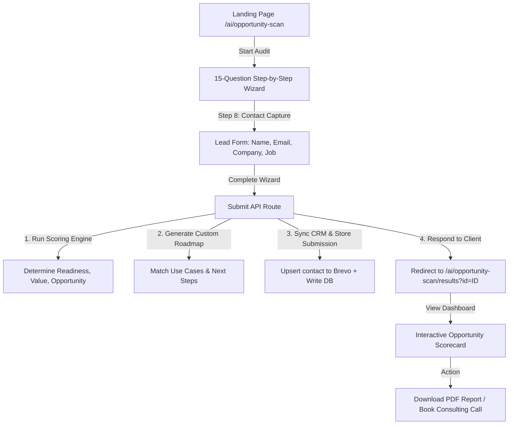

# Product Requirement Document (PRD): AI Opportunity Audit

This document outlines the product requirements and technical architecture for the **AI Opportunity Audit** module of the PixelPunch AI Assessment Platform.

---

## 1. System Goal & Value Proposition

The AI Opportunity Audit is designed as a lead generation and consultative sales tool for PixelPunch. It targets highly engaged prospects (via email campaigns and organic traffic) to:
- Collect key business context, operational patterns, and technical readiness indicators.
- Analyze processes to find bottlenecks and automation opportunities.
- Calculate an **AI Readiness & Feasibility Score**.
- Output a personalized **AI Opportunity Roadmap** mapping out immediate wins (Phase 1) and mid-to-long term AI initiatives (Phase 2 & 3).
- Fast-track qualified leads (Tier 1 & 2) directly into PixelPunch's consulting pipeline.

---

## 2. User Journey Flow

1. **Discovery & Onboarding**: The user lands on `/ai/opportunity-scan`. The page displays trust badges ("3-minute diagnostic", "No login required", "Personalized AI Roadmap").
2. **The Questionnaire**: A clean, Typeform-style step-by-step wizard. To optimize completion rate, questions are grouped logically by topic:
   - *Operational Context* (Context & Priority)
   - *Workflows & Inefficiencies* (Pain points & manual work)
   - *Data & Integration Infrastructure* (Data assets & technical readiness)
   - *Support, Sales & Intent* (Qualification, desired AI interest, blockers)
3. **Contact & Context Capture**: In the final steps, the user inputs their contact info (name, email, company, title) and is offered an optional field to paste their website URL or upload internal process notes.
4. **Instant Assessment Dashboard**: Redirects to `/ai/opportunity-scan/results?id=<uuid>`. Displays a premium visual scorecard:
   - **AI Readiness Score** (RAG badge)
   - **Business Value Potential** (RAG badge)
   - **Automation Feasibility** (RAG badge)
   - **3 Tailored AI Recommendations** (Short-term, Medium-term, Long-term)
   - **Downloadable PDF Report** and an inline scheduling widget to book a review call.

---

## 3. Questionnaire Structure & Data Points

The system collects 15 key questions (based on the AI Opportunity Audit Handover), mapped to specific fields for scoring:

| # | Question | Input Type | Options / Enums | Analytical Significance |
|---|---|---|---|---|
| **Q1** | What best describes your business? | Select | SaaS, Agency, Retail, Healthcare/Finance, Other | Establishes operating model, regulatory risk, and standard workflow patterns. |
| **Q2** | What is the main outcome you want to improve right now? | Select | More leads, Higher conversion, Faster follow-up, Lower manual work, Other | Identifies the immediate business metric and value driver the prospect cares about. |
| **Q3** | What is the biggest operational challenge you are facing today? | Select | Slow processes, Too much manual work, Data scattered, Sales gaps, Other | pinpoints the primary bottleneck to align with specific AI solutions. |
| **Q4** | What systems currently hold the most important customer or operational data? | Select | CRM, ERP, Helpdesk, Spreadsheets, Other | Indicates where data is stored and whether a structured data layer exists. |
| **Q5** | What is currently preventing your workflows from becoming more automated? | Select | Data not centralized, Tools don't integrate, Team relies on manual steps, No process design, Other | Identifies technical blockers (middleware vs process engineering). |
| **Q6** | How standardized are your core workflows? | Select | Very, Somewhat, Mostly ad hoc, Not sure, Other | Measures operational maturity. Standardized workflows are easier to automate with AI. |
| **Q7** | Which processes still require significant manual effort? | Multi-select | Data entry, Email/follow-up, Reporting, Customer support, Other | Uncovers clear use cases (Document AI, Support Automation, etc.). |
| **Q8** | How do employees currently find information they need to do their jobs? | Select | Shared drives, Internal docs, Slack/Teams, Ask colleague, Other | Identifies opportunities for Enterprise Search, RAG knowledge bases, or Copilots. |
| **Q9** | How connected are your systems today? | Select | Fully integrated, Partially integrated, Mostly disconnected, Not sure, Other | Reveals degree of system fragmentation and API accessibility. |
| **Q10**| How would you describe the quality of your data? | Select | Clean, Gaps/duplicates, Inconsistent, Poor, Other | Evaluates LLM readiness. AI requires reliable data; poor data requires prep work first. |
| **Q11**| How do you currently handle customer inquiries or internal requests? | Select | Humans handle most, Partly automated, Ticketing system, Email-based, Other | Evaluates maturity of support workflows. |
| **Q12**| What is the most common type of support or communication request you receive? | Select | Basic FAQs, Billing, Tech issues, Sales inquiries, Other | Identifies opportunities for customer-facing or internal support agents. |
| **Q13**| How are leads currently qualified? | Select | Manually, Automated rules, CRM scoring, Not formally qualified, Other | Identifies potential for AI lead routing, email agents, or sales development. |
| **Q14**| Which AI use case would create the most value for you right now? | Select | Automating tasks, Customer support, Sales follow-up, Internal knowledge, Other | Self-reported buyer intent. Determines the hook for follow-up sales discussions. |
| **Q15**| What has prevented you from adopting AI faster? | Select | Lack of use cases, Data quality, Tech complexity, Budget concerns, Other | Highlights adoption hurdles (education, technical barriers, budget). |

---

## 4. AI Analysis & Scoring Logic

The scoring engine evaluates three core dimensions, calculating a RAG (Red/Amber/Green) score for each:

### Dimension A: Business Value Potential (Value Score)
*Evaluates the severity of operational pain and business impact.*
- **High (Red Urgency)**: Biggest challenge is "margin pressure" or "slow processes" (Q3) and target outcome is "lower manual work" (Q2).
- **Medium (Amber)**: Target outcome is marketing/sales-driven ("more leads", "higher conversion") (Q2).
- **Low (Green)**: Process is mostly ad-hoc or priority is unclear.

### Dimension B: Technical Feasibility & Readiness (Readiness Score)
*Evaluates how ready the data and systems are to support AI.*
- **High (Green - Ready)**: Workflows are "Very standardized" (Q6), Data is "Clean" (Q10), Systems are "Fully integrated" (Q9).
- **Medium (Amber)**: Workflows are "Somewhat standardized" (Q6), Systems "Partially integrated" (Q9), with some data gaps.
- **Low (Red - Not Ready)**: Workflows are "Mostly ad hoc" (Q6), Systems "Mostly disconnected" (Q9), Data quality is "Poor" (Q10).
  *(Note: A low readiness score doesn't mean exclude; it highlights that the prospect needs data consolidation consulting before deploying AI).*

### Dimension C: Automation Opportunity Density (Opportunity Score)
*Measures the volume of repetitive tasks that can be automated.*
- **High (Red - High Potential)**: 3+ manual processes selected in Q7 (e.g., Data entry, Reporting, Customer support) and inquiry handling is "Humans handle most" (Q11).
- **Medium (Amber)**: 1-2 manual processes selected in Q7.
- **Low (Green)**: Minimal manual processes identified.

---

## 5. Lead Scoring & Routing (Tiers)

Prospects are classified into **four routing tiers** to prioritize sales follow-up:

1. **Tier 1 (Strong AI Fit - Sales Fast-Track)**:
   - *Criteria*: High Business Value Potential AND High Technical Readiness AND High Opportunity Density.
   - *Action*: Trigger active Brevo sales sequences; direct calendar invite CTA.
2. **Tier 2 (AI Consulting Candidate - Scoped Discovery)**:
   - *Criteria*: High Opportunity Density but Low/Medium Technical Readiness (data silos, ad-hoc processes).
   - *Action*: Position consulting for "AI-Ready Data Architecture" or "Process Mapping".
3. **Tier 3 (Future Nurture)**:
   - *Criteria*: Medium Opportunity, low-to-medium readiness.
   - *Action*: Automated newsletter sequences sending case studies.
4. **Tier 4 (Exclude / Self-Serve)**:
   - *Criteria*: Very early stage (e.g., "no production AI", "budget concerns", low volume).
   - *Action*: Offer self-serve guide / resources page.

---

## 6. Output Report Structure

The generated scorecard and PDF report will follow a clean, premium format:

1. **Executive Summary**: A personalized greeting addressing the business context (based on Q1: Business Type).
2. **Readiness Matrix (RAG Scorecard)**:
   - **AI Readiness**: [R/A/G]
   - **Business Value Potential**: [R/A/G]
   - **Automation Feasibility**: [R/A/G]
3. **Primary AI Opportunities**: Three tailored use cases derived from the questionnaire (e.g. if Q7 contains "customer support" and Q12 is "Basic FAQs", recommend a RAG-based Support Assistant).
4. **AI Roadmap Matrix**:
   - **Phase 1: Quick Wins** (High Feasibility / High Value) - e.g., CRM automations.
   - **Phase 2: Core Enhancements** (Medium Feasibility / High Value) - e.g., RAG Knowledge Base.
   - **Phase 3: Strategic Transformations** (Low Feasibility / High Value) - e.g., Custom AI agents.
5. **PixelPunch Call-to-Action**: Scoped next steps (e.g., "Request a Technical Architecture Deep Dive").

---

## 7. Required Backend Components

To preserve the modular architectural requirements, the Opportunity Audit will live entirely under `modules/opportunity-audit` and share resources in `shared/`:

- **Schema definition**: `modules/opportunity-audit/schema/opportunity-schema.json` - defines questionnaire validation parameters.
- **Scoring Engine**: `modules/opportunity-audit/scoring/opportunity-score-engine.ts` - pure functions calculating RAG values, tiers, and recommendations.
- **API Submit Endpoint**: `app/api/opportunity-scan/submit/route.ts` - handles requests, triggers rate-limiting, runs validation, saves submission to DB via `shared/database/db.service.ts`, syncs to Brevo via `shared/utils/brevo.service.ts`, and returns results.
- **PDF Report Template**: `modules/opportunity-audit/results/PdfReportTemplate.tsx` - PDF report layout for download generation.

---

## 8. Required Frontend Pages & Components

- **Wizard UI Page**: `/ai/opportunity-scan/page.tsx`
  - Reuses shared styles and contact input forms.
  - Step-by-step presentation using `framer-motion` for transitions.
- **Wizard Steps components**: `modules/opportunity-audit/questions/steps/`
  - Step components mapping the 15 questions.
- **Results Dashboard Page**: `/ai/opportunity-scan/results/page.tsx`
  - Visual display of readiness gauges, tailored recommendations, and interactive roadmap timelines.
- **Action Buttons**:
  - Download PDF report button.
  - Schedule consultation calendar embed.
